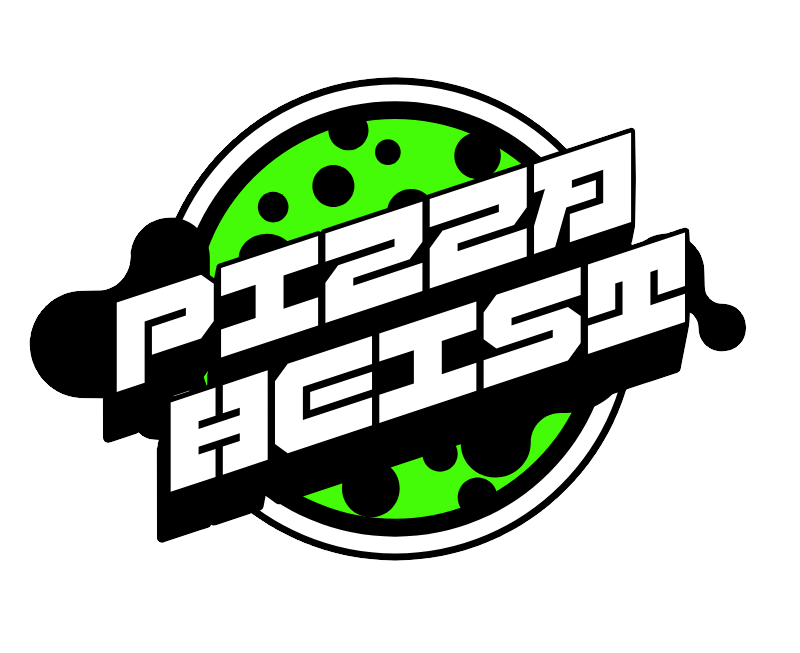
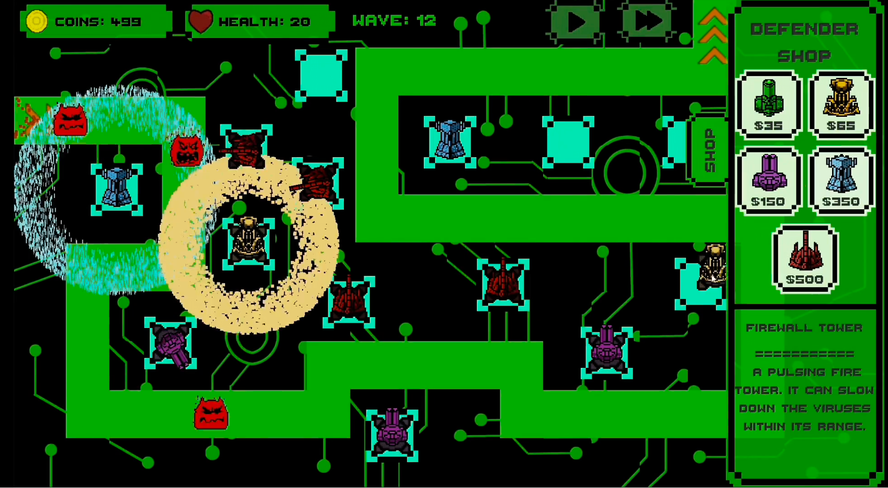
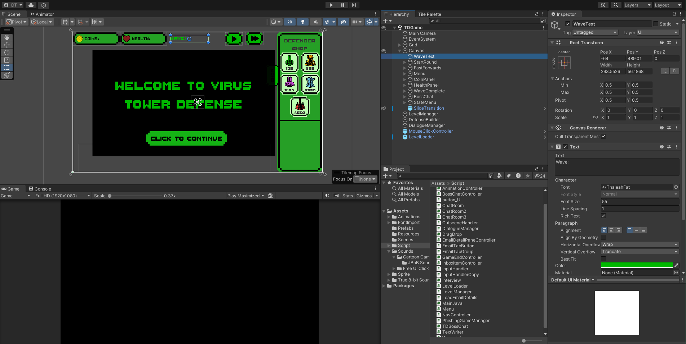
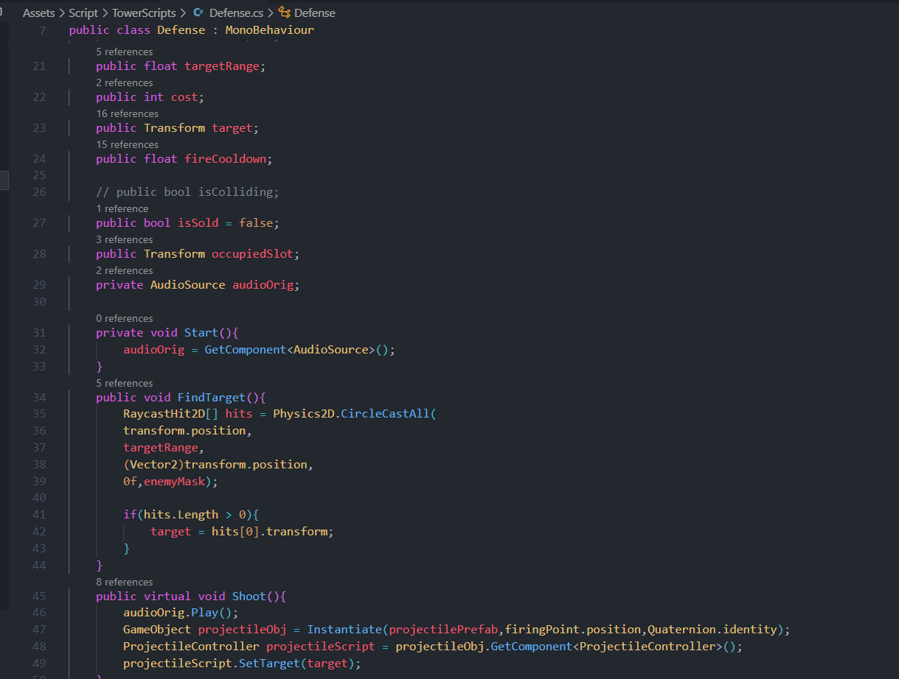

<!-- height or width of logo may be adjusted -->
<!-- This section is where you will replace the link to your transparent logo, the title of your project, and the very short desciptor of your project -->
<!-- If you used Canva to make your icon and don't want to pay for a background remover, you can use the website https://www.remove.bg/ to do so -->

  
  <h1 align="center">Pizza Heist: A Cybersecurity Threat Awareness Game</h1>
  
A project for students by team Rocket Pizza 

<!-- the emojis are not set in stone! If you'd like you can remove them entirely or select your own from https://gist.github.com/rxaviers/7360908 you are welcome to -->

## :loudspeaker: About

This workshop is designed to introduce students to foundational cybersecurity concepts,
covering topics such as password protection,phishing, and virus identification. 
Through an engaging presentation and interactive discussions, participants will gain insights into safeguarding personal digital data. 
Following this, students will apply their knowledge in a hands-on game,
navigating a series of mini-games with the objective of reaching the end without falling victim to cyber threats.
## :bulb: Project Information
<!-- 
Your Options for target audience: 
  - High School
  - College
  - Middle School
  - K-12
  - Non-Stem
  - Undergraduate
You can select from a range of audiences or a single auidience. Examples: 
    Middle School - College 
    High School - College
    K-12
  You will be presenting most often to your peers who are taking introductory technology classes, so more often than not you should be including college in your target audience range. 
-->
* <b>Difficulty Level:</b> Beginner
* <b>Target Audience:</b> Middle School - College
* <b>Duration of Workshop:</b> 1 hour
* <b>Needed Materials:</b> Computer or laptop with a keyboard and mouse/trackpad
* <b>Learning Outcomes:</b> To teach participants about the importance of internet safety through the implementation of a fun and entertaining environment using Unity
* <b>Your Main Technology</b> Unity, a cross-platform game engine
* [Technology Ambassador Program](https://tapggc.org/) <b>(TAP)</b> is a project-based class that provides a collaborative environment for students to work with their fellow classmates on a semester-long project using technologies of their choice. TAP strives to increase participation in IT through numerous outreach activities and workshops that are designed to showcase the creative and fun side of technology.
<!-- Commercial Video stored in the Media folder will be linked here -->

[Commercial Video](https://github.com/user-attachments/assets/eceaebc8-4b74-4d95-939e-ff34d4e34a59)

<!-- videos can also be dragged and dropped into markdown files if you want them embedded -->

## :pencil2: Team: Rocket Pizza

<!-- Use the team photo of your choice once you have uploaded it to the team photo folder within the media folder -->

> (From left to right: Nikki Thao, Brian Ramos, Daniel To.)
<!-- replace with full names of your team members -->

* Nikki Thao
* Brian Ramos
* Daniel To

## :mortar_board: Advisors
<!-- name of the two professors overseeing your TAP class -->
* Dr. Cengiz Gunay
* Dr. Cindy Robertson

## :page_with_curl: Project Description
This project was inspired by the rising number of individuals falling victim to cybersecurity threats like phishing and malware.
In response, this project aims to design and develop an engaging introductory cybersecurity game tailored for beginners. 
The game provides an interactive experience that introduces players to essential cybersecurity concepts, including phishing, password security, viruses, and antivirus measures. 
Thoughtfully designed with hints and guidance, the game helps players understand the purpose and learning objectives behind each mini-game, making cybersecurity education both accessible and enjoyable.

## :memo: Publications
<!-- team members, then professors/advisors. "Name of Publication", event, month and day, year, Georgia Gwinnett College. -->
1. <b>CCSC:SE Abstract</b> - Brian Ramos-Cazares, Niiki Thao, Daniel To. Pizza Heist: Cybersecurity Threat Awareness Game, Consortium for Computing Sciences in
Colleges: Southeastern Region (CCSC:SE), November 1-2, 2024, Greenville, SC.
2. <b>CREATE Symposium Poster </b> - Brian Ramos-Cazares, Niiki Thao, Daniel To. CREATE Symposium Poster, Nov. 21, 2019, Georgia Gwinnett College.

## :open_hands: Outreach
<i>List the outreach events we have participated in. </i>

1. <b>TAP Expo</b>, October 8, 2024, Georgia Gwinnett College: to promote the IT field and encourage college students to sign up for TAP.
2. <b>Class Workshops</b>, October 22-24, 2024, Georgia Gwinnett College: to promote the IT field to non-IT students.
3. <b>CCSC Conference</b>, November 1-2, 2024, Furman University: to help teach tips and tricks for developing successful technology projects for introduction to programming and outreach.
4. <b>Super Saturday Series</b>, November 16, 2024, Georgia Gwinnett College: to promote the IT field to non-IT students.

## :mag_right: Similar Projects

If you're interested in more workshops that utilize Unity, check out [SliceIT!](https://github.com/TAP-GGC/SliceIT) or [PixelArcade](https://github.com/TAP-GGC/Pixel8)!

## :computer: Technology

<!-- be sure to use the alt text feature in case anybody viewing your repo is using  screen reader! you want your workshop to be as accessible as possible -->

  

* [Unity](https://unity.com/) is a versatile cross-platform game engine that allows users to develop and create intereactive experiences and games in both 2D and 3D environments.

<i>An image of the unity game engine and its different feature.</i>

  
  
  

<i>This is an image of C# code running in unity.</i>

  

<!--#### Why We Chose Unity for This Project:
 * Our project leverages Unity to develop a cybersecurity-themed 2D game, aimed at simplifying cybersecurity concepts for a non-technical audience. Unity's robust 2D framework, featuring the Canvas and Tilemap systems, facilitates the creation of engaging mini-games where players interact with simulated Windows applications, teaching cybersecurity principles. The engine's extensive asset library and physics capabilities also enhance gameplay, providing dynamic and user-friendly experiences.
* We considered Unity, Blender, and Scratch as candidate for our games. Unity was the clear choice due to its strong support for 2D game mechanics, UI systems, and physics components. While Blender is excellent for 3D modeling and rendering, it lacks focus on game development logic. Scratch, though simple and accessible, does not support the depth of features we need for our game.
* Unity’s asset store offers a variety of resources, saving time in finding or creating objects and sprites, despite us not utilize the assets besides sounds.
* Since our team has a background in Java, transitioning to Unity’s primary language, C#, is efficient due to the similarities in syntax and structure.
* We also sought the challenge of using a full-featured game engine to gain hands-on experience with its functionality, enabling us to build a comprehensive game with a custom graphical user interface.
-->

## Project Setup

### Installation for Unity
[Click here to view instructions](documents/tutorial%20materials/Instruction%20for%20Unity.pdf)

[Video with Unity Instruction](https://github.com/user-attachments/assets/5b51856d-932d-4d32-9733-a07da1e3140d)

### Aesprite Tutorial
[Video For Aesprite Tutorial](https://github.com/user-attachments/assets/2234447b-1d55-49bb-b98b-bd13512f1dd5)

<!-- if your project uses scratch, you can reuse any of these instructions (be sure to include CS First alternatives)
## CS First Installation Walkthrough
[Click here to view instructions](/Documents/tutorial/CS%20FIRST/CS%20First%20Walkthrough.md)

### Getting to the game 
[Click here to view instructions](/Documents/tutorial/Getting%20to%20the%20Game.md) -->

## Usage

#### Desktop and Phishing Game Controls
1. Click LEFT mouse button to interact in the game.
#### Virus Tower Defense Game Controls
1. Click LEFT mouse button to interact in the game.
2. Click & Drag LEFT mouse button to move the towers on the Square.
3. Click Right mouse button to Sell Towers.

## Short Demo Instructions 

[Our Game Demo Video](https://github.com/user-attachments/assets/fed08917-d255-474f-ba2e-55a6dcbcf3e1)

## Workshop Instructions 
<i>Need PDF instructions of our Workshop walkthrough

[Our Game Workshop Video](https://github.com/user-attachments/assets/5f82f821-cd4b-47e3-ada8-b617bd018bee)

